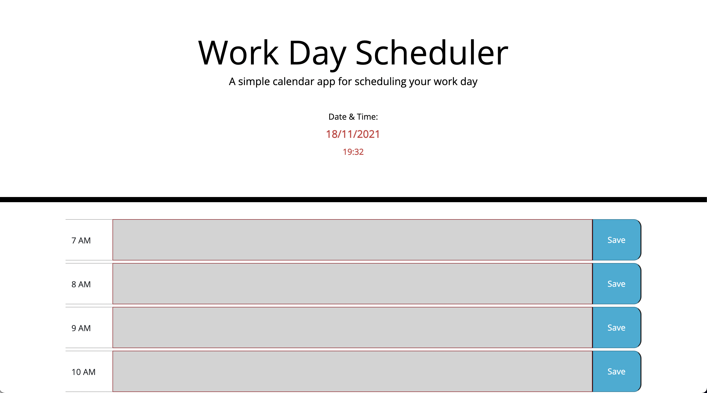
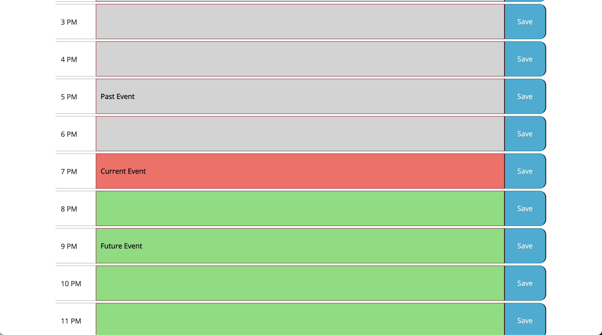

# Work Day Scheduler Starter Code

## Description
A daily scheduler with time slots for each hour. The slots will change color according to the current time. The content of the planner can be saved and loaded when the page is reopenned. 

## Screenshots

## Link to Application
[Work Day Planner](https://ethanc29.github.io/Work-Day-Planner/)
